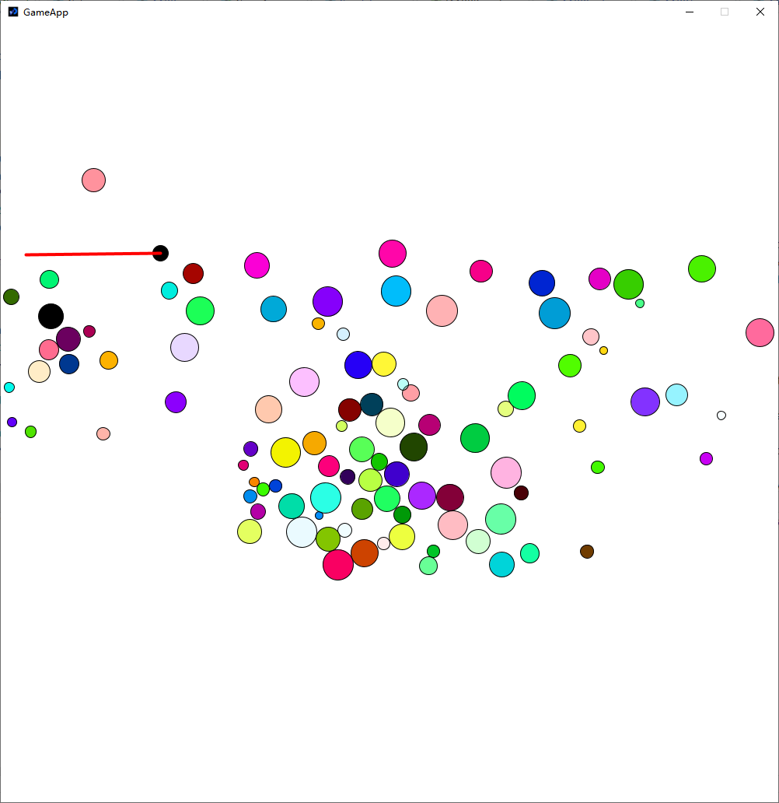

# AABBTree Test

An attempt at writing an AABB tree, bundled with a testing program written in Processing Java.
Tree has dubious quality. If you know how to improve this please reach out to me about it in the Issue Tracker.

### Basics

The hue of the spheres are random. 

The darkness indicates the density, which is combined with the area of the circle `pi * r * r` to calculate mass.

Mass is used in elastic collision calculations from Wikipedia article on 
[Elastic Collisions](https://en.wikipedia.org/wiki/Elastic_collision#One-dimensional_Newtonian).

The red line is an ideal spring between the black particle and the mouse.

### How to Run
1. Java 17 is required.
2. Add some JARs as dependencies. They should be in the `lib` folder.
   - `core.jar`: Processing 4.0 core library. Obtained from "How to use Processing as Java Library" tutorial.
   - `jsr305-3.0.2.jar`: used for `engine.annotation.NotNullByDefault`.
3. The project should compile. A prebuilt jar is available [here](IJ-AABBTree.jar).
The main class is `lordxerus.aabbtest.main.GameApp`.

### Project Structure
- `engine`: These files implement the AABB Tree
  - `aabb_tree`:
    - `IAABBChild`: Implemented by all nodes that can be a child: `AABBNode`, `AABBInternal`, `AABBLeaf`.
      Must have an AABB and implement `getAABB()`.
    - `IAABBParent`: Implemented by all nodes that can be a parent: `AABBTreeHandle`, `AABBInternal`.
    - **++++++++++++++++++++**
    - `AABBNode`: Abstract class that implements children functionality. 
      Primarily `getParent()`, `setParent()`, and `join()`,
      which joins 2 children under a new `AABBInternal`.
    - `AABBInternal`: The Internal Node of the AABB tree. 
      Has 2 children and 1 parent. Extends `AABBNode`. 
      Its AABB is the result of merging its 2 `IAABBChild`'s `getAABB()`.
    - `AABBLeaf`: The leaf of the AABBTree. Contains an integer which represents the `AABBItem`, and an AABB.
    - `AABBTreeHandle`: Root of the tree that serves as an `IAABBParent` of the topmost `AABBInternal`
      Has the ability to insert new nodes into its children.
    - **++++++++++++++++++++**
    - `AABBTree`: A public class that represents a Tree. Exposes methods for `create()` and `query()`.
      Contains a `ArrayList` that converts the integer stored in an `AABBLeaf` to its respective `AABBItem`
    - `AABBItem`: A public class. Created by the factory method `AABBTree::create()`.
      Can `move()` or `destroy()` itself. 
  - `annotation.NotNullByDefault`: An annotation copied somewhere online that 
    makes IntelliJ spit out warnings when you use nulls without declaring them
  - `AABB`: A class that represents an AABB. 
    Contains useful functions such as `intersects()`, `contains()`, and `merge()`.
  - `Vector2`: A class that represents a 2-dimensional vector, such as a position or velocity.
- `main`:
  - `Color`: A basic color class that has some constant colors, linear interpolation, and `fromHSV()`.
  - `Particle`: A sphere in the demo. Has a position and speed. Also has collision with wall and other `Particle`s
  - `Simulation`: The class that represents the demo. 
    Contains a surface to draw on, a list of particles, and an `AABBTree`.
  - `GameApp`: **Entry Point.** Creates the particles, 
    then handles some basic tasks like calculating deltatime, applying force to the user-controlled particle .etc

### License 
For most part, don't be a jerk.

For completeness, I believe the components of the project require this project to be 
licensed under [GNU LGPLv3](doc/lgpl3.txt) unless otherwise specified.

All rights reserved?
